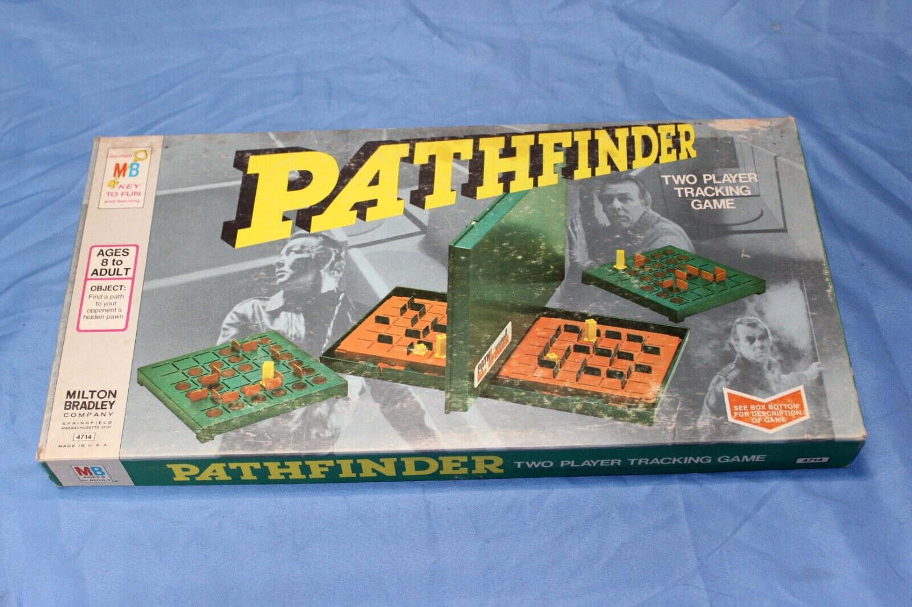
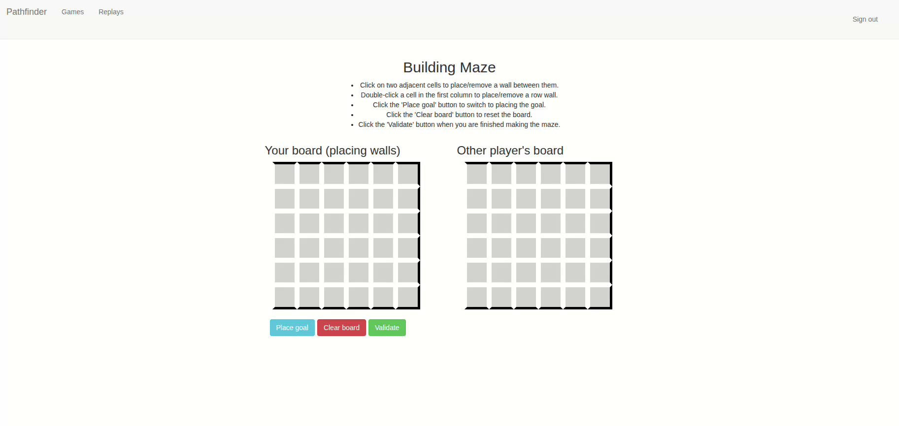
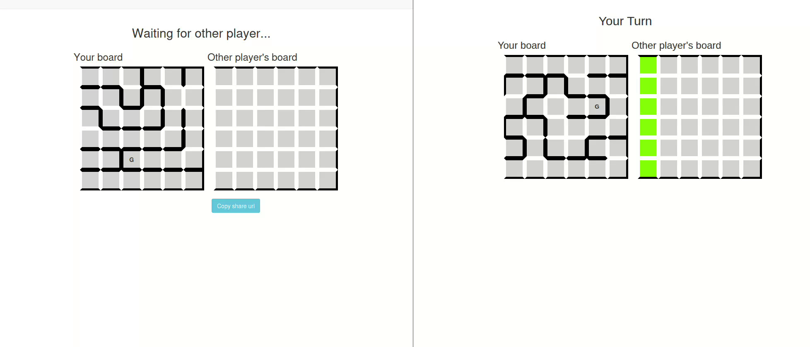
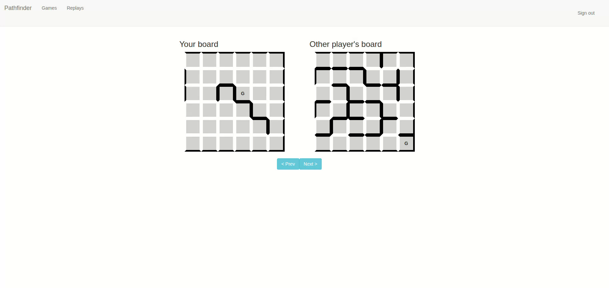

# Pathfinder

A web application for the 1977 Milton Bradley board game where both players construct a maze
and the first player to navigate through the other players maze and reach
the goal is the winner.

Building mazes:

Gameplay from the perspective of both players:

Replay view after a game has finished:

